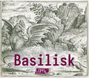

# Basilisk: Machine Learning framework 

Basilisk is a Machine Learning framework written in Rust, currently in early development.

TODO:
	- Linear Algebra library for matrices and tensors
	- CPU and GPU backend 
	- Python3 frontend
